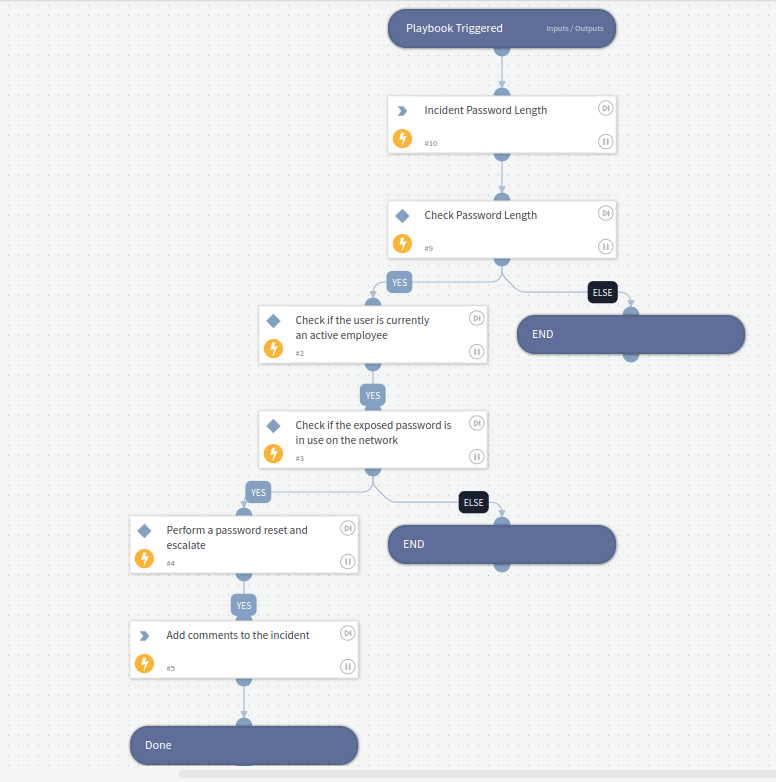

## SpyCloud - Breach Investigation

This playbook gets triggered when an incident of `SpyCloud Breach Data` type is created. The Playbook:

- Check if the breached password length is >= the minimum required by the organization. If not, exit the playbook.
- Check if the user is currently an active employee. If not, exit the playbook.
- Check if the exposed password is in use on the network (check AD, check Okta, check Ping, check G-Suite, etc.
- If the password is in use in one of the checked systems, perform a password reset, raise an incident, etc.

### Note:
This playbook acts as a basic structure, offering users a point of reference. Kindly perform your own internal logic for the following task:

- Provide the password length as playbook input.
- Task-2 "Check if the user is currently an active employee"
- Task-3 "Check if the exposed password is in use on the network"
- Task-4 "Perform a password reset and escalate"

## Dependencies

This playbook uses the following sub-playbooks, integrations, and scripts.

### Sub-playbooks

This playbook does not use any sub-playbooks.

### Integrations

SpyCloud Enterprise.

### Scripts

* StringLength

### Commands

* setIncident

## Playbook Inputs
| **Name**               | **Description** | **Default Value** | **Required** |
|------------------------| --- |-------------------|-----------|
| Minimum Password Length | Minimum Password Length | 8 | Required. |

## Playbook Outputs

---
There are no outputs for this playbook.

## Playbook Image

---

